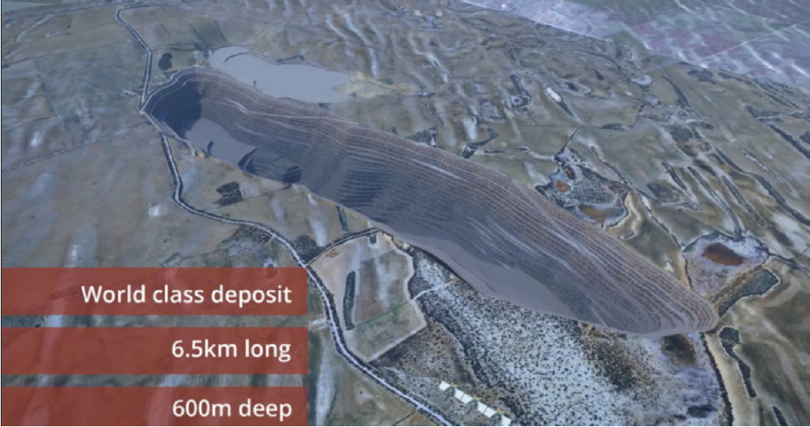

<html>
  <body>
    <h1>Monalco Mining</h1>
    
  </body>

As a budding data scientist on the Insights & Analytics (IA) team, it is critical that you
know how to clearly structure a problem and break it down into manageable parts. You
will achieve this by creating a Problem Statement Worksheet (PSW) to clearly define the
scope and goal of the project. Your work will be used by your team lead, Chris, to steer
the direction the team undertakes to resolve the current spending issue Monalco is
facing.
Additionally, the completion of these deliverables will serve to reinforce the concepts
you have learned throughout the Problem Identification unit and further emphasize the
value of these tools. Your team lead, Chris, has forwarded you emails with additional
information gathered by the maintenance subject matter experts, Tara and Bruce, to
help with the project.
</body>
</html>
